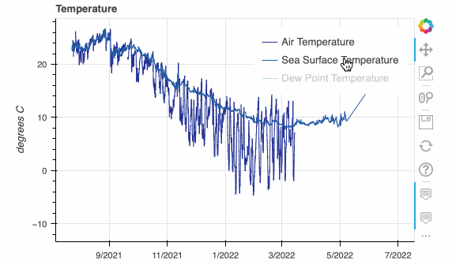
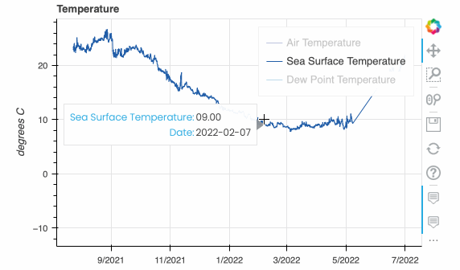
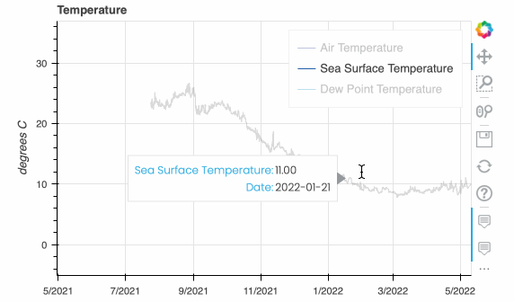
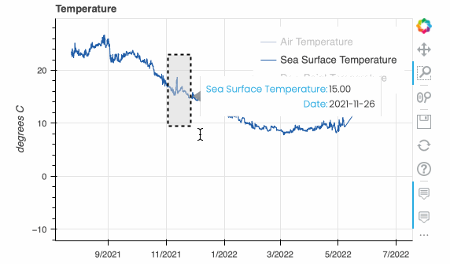

# Buoy Explore App
Explore buoy data from the National Buoy Data Center (NBDC).

### Project Information

**Class**: OCG592 Independent Study

**Due**: August 19, 2022

**Objective**: Create a data driven tool that generates labeled plots to compare trends and allows a user to observe key measurements from historical data and real-time data for a buoy location, coded in Python.

**How to run the file**
- Download the code and unzip the file
- Open terminal and navigate to inside the folder `buoy-explore-app`
- Run the command `pip install -r requirements.txt` to install all required dependencies for the project
- Run the command `bokeh serve --show buoy-app`
- The command will open a new tab in your default browser and load the project
- [Watch the video walkthrough!](https://sharing.clickup.com/clip/p/t2245209/66fb2021-777d-4510-8201-cc4149af69ef/screen-recording-2022-08-13-12:37.webm)

### Key Features  
#### Charts  

*Toggle chart data with legend*  
All chart data can be toggled on/off with the legend on the top right of each plot. Simply click on/off to hide or display data.  

*Hover tool tips*  
All charts have a tooltip hover by default. To view exact data simply hover over the chart.  

#### Chart Tools  
*Pan Tool*  
The pan tool allows you to pan the plot by left-dragging a mouse or dragging a finger across the plot region.  

*Box Zoom Tool*  
Click on the chart tool with the magnifying glass in a square. Once active, the box zoom tool allows you to define a rectangular region to zoom the plot bounds to by left-dragging a mouse, or dragging a finger across the plot area.  

*Save Tool*  
The save tool pops up a modal dialog that allows you to save a PNG image of the plot.  

*Refresh Tool*  
The reset tool restores the plot ranges to their original values.

**Known issues**  
- No known issues at this time

**Additional notes**  
- No additional notes at this time
